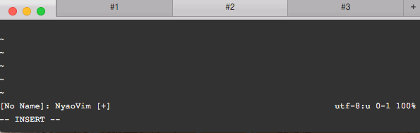

All Screenshots
===============

## [clever-f.vim/](https://github.com/rhysd/clever-f.vim/)
* [cleverf_1.gif](clever-f.vim/cleverf_1.gif)

* [cleverf_2.gif](clever-f.vim/cleverf_2.gif)

* [cleverf_3.gif](clever-f.vim/cleverf_3.gif)

* [cleverf_4.gif](clever-f.vim/cleverf_4.gif)

* [cleverf_main.gif](clever-f.vim/cleverf_main.gif)

## [crdoc/](https://github.com/rhysd/crdoc/)
* [crdoc.gif](crdoc/crdoc.gif)

* [peco-crdoc.gif](crdoc/peco-crdoc.gif)

## [Crisp/](https://github.com/rhysd/Crisp/)
* [crisp.gif](Crisp/crisp.gif)

## [ezoe/](https://github.com/rhysd/ezoe/)
* [ezoe.png](ezoe/ezoe.png)

## [github-complete.vim/](https://github.com/rhysd/github-complete.vim/)
* [emoji_completion.gif](github-complete.vim/emoji_completion.gif)

* [issue_completion.gif](github-complete.vim/issue_completion.gif)

* [japanese_workaround.gif](github-complete.vim/japanese_workaround.gif)

* [link_completion.gif](github-complete.vim/link_completion.gif)

* [repo_completion.gif](github-complete.vim/repo_completion.gif)

* [user_completion.gif](github-complete.vim/user_completion.gif)

## [Irasutoyer/](https://github.com/rhysd/Irasutoyer/)
* [advanced.gif](Irasutoyer/advanced.gif)

* [Irasutoyer-linux.png](Irasutoyer/Irasutoyer-linux.png)

* [Irasutoyer.gif](Irasutoyer/Irasutoyer.gif)

* [menu-items.png](Irasutoyer/menu-items.png)

* [scraping.gif](Irasutoyer/scraping.gif)

## [neovim-component/](https://github.com/rhysd/neovim-component/)
* [neovim-component-linux.png](neovim-component/neovim-component-linux.png)

## [NyaoVim/](https://github.com/rhysd/NyaoVim/)
* [progress.gif](NyaoVim/progress.gif)

## [PocketTrend/](https://github.com/rhysd/PocketTrend/)
* [main.png](PocketTrend/main.png)

## [react-embedded-browser/](https://github.com/rhysd/react-embedded-browser/)
* [main.gif](react-embedded-browser/main.gif)

## [Rocket/](https://github.com/rhysd/Rocket/)
* [progress.png](Rocket/progress.png)

## [rust-doc.vim/](https://github.com/rhysd/rust-doc.vim/)
* [rust-doc.vim.gif](rust-doc.vim/rust-doc.vim.gif)

* [unite-rust-doc.gif](rust-doc.vim/unite-rust-doc.gif)

## [Shiba/](https://github.com/rhysd/Shiba/)
* [dock.png](Shiba/dock.png)

* [menu-errors.png](Shiba/menu-errors.png)

* [menu-no-error.png](Shiba/menu-no-error.png)

* [shiba-main-0.1.0.png](Shiba/shiba-main-0.1.0.png)

* [shiba-mermaid-integ.png](Shiba/shiba-mermaid-integ.png)

* [shiba-screenshot.gif](Shiba/shiba-screenshot.gif)

* [window-lint.png](Shiba/window-lint.png)

* [window-main.png](Shiba/window-main.png)

## [SoundKloud/](https://github.com/rhysd/SoundKloud/)
* [menubar.png](SoundKloud/menubar.png)

* [overall.png](SoundKloud/overall.png)

## [Stream/](https://github.com/rhysd/Stream/)
* [mainwindow.gif](Stream/mainwindow.gif)

## [Tilectron/](https://github.com/rhysd/Tilectron/)
* [current-progress.gif](Tilectron/current-progress.gif)

## [try-colorscheme.vim/](https://github.com/rhysd/try-colorscheme.vim/)
* [try-colorscheme.gif](try-colorscheme.vim/try-colorscheme.gif)

## [unite-emoji.vim/](https://github.com/rhysd/unite-emoji.vim/)
* [unite_emoji.gif](unite-emoji.vim/unite_emoji.gif)

## [unite-go-import.vim/](https://github.com/rhysd/unite-go-import.vim/)
* [unite-go-import.gif](unite-go-import.vim/unite-go-import.gif)

## [unite-n4140.vim/](https://github.com/rhysd/unite-n4140.vim/)
* [unite-n4140.gif](unite-n4140.vim/unite-n4140.gif)

## [vim-color-shiny-white/](https://github.com/rhysd/vim-color-shiny-white/)
* [screenshot.png](vim-color-shiny-white/screenshot.png)

## [vim-color-splatoon/](https://github.com/rhysd/vim-color-splatoon/)
* [color-splatoon-1on1.gif](vim-color-splatoon/color-splatoon-1on1.gif)

* [color-splatoon-random.gif](vim-color-splatoon/color-splatoon-random.gif)

* [color-splatoon.gif](vim-color-splatoon/color-splatoon.gif)

## [vim-crystal/](https://github.com/rhysd/vim-crystal/)
* [completion.gif](vim-crystal/completion.gif)

* [formatting.gif](vim-crystal/formatting.gif)

* [highlight1.png](vim-crystal/highlight1.png)

* [jump-to-definition.gif](vim-crystal/jump-to-definition.gif)

* [show-context.gif](vim-crystal/show-context.gif)

* [show-hierarchy.gif](vim-crystal/show-hierarchy.gif)

* [spec.gif](vim-crystal/spec.gif)

## [vim-textobj-conflict/](https://github.com/rhysd/vim-textobj-conflict/)
* [textobj-conflict.gif](vim-textobj-conflict/textobj-conflict.gif)

