All Screenshots
===============

## [vim-textobj-conflict/](https://github.com/rhysd/vim-textobj-conflict/)
* [textobj-conflict.gif](vim-textobj-conflict/textobj-conflict.gif)

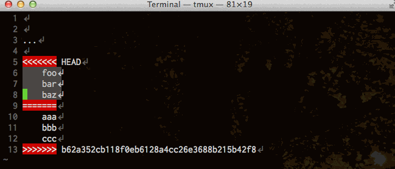

## [Tilectron/](https://github.com/rhysd/Tilectron/)
* [current-progress.gif](Tilectron/current-progress.gif)

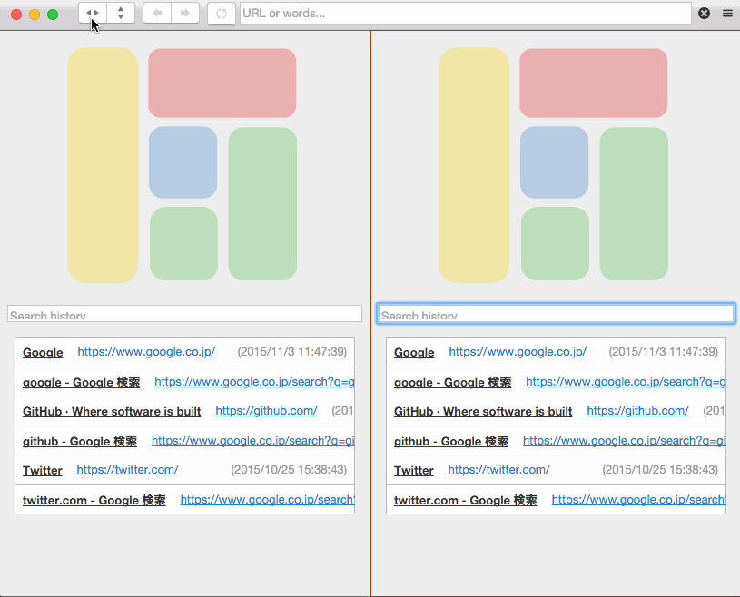

## [NyaoVim/](https://github.com/rhysd/NyaoVim/)
* [structure.png](NyaoVim/structure.png)

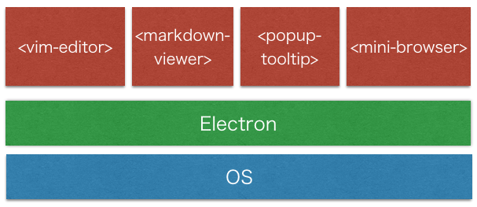

* [old-implementation.gif](NyaoVim/old-implementation.gif)

## [Stream/](https://github.com/rhysd/Stream/)
* [mainwindow.gif](Stream/mainwindow.gif)

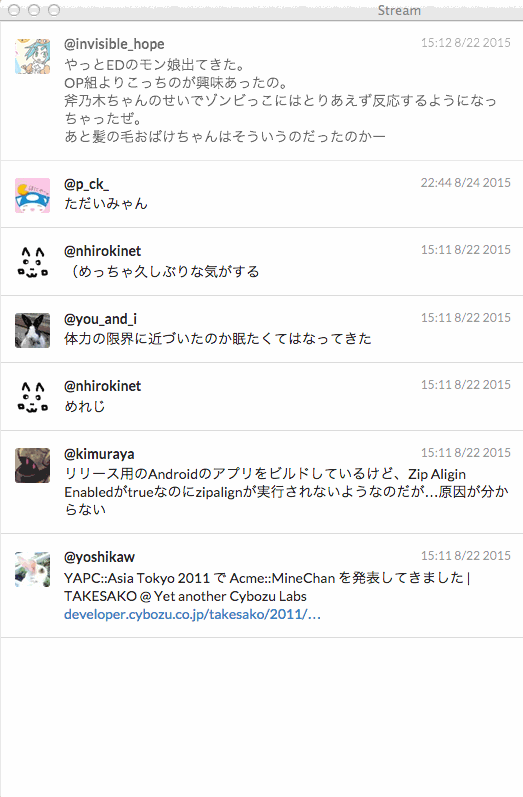

## [unite-go-import.vim/](https://github.com/rhysd/unite-go-import.vim/)
* [unite-go-import.gif](unite-go-import.vim/unite-go-import.gif)

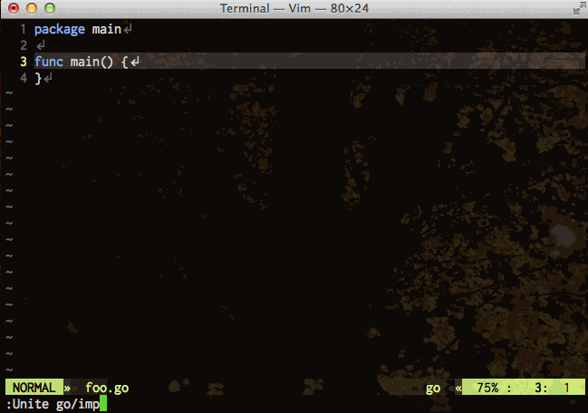

## [vim-crystal/](https://github.com/rhysd/vim-crystal/)
* [highlight1.png](vim-crystal/highlight1.png)

* [jump-to-definition.gif](vim-crystal/jump-to-definition.gif)

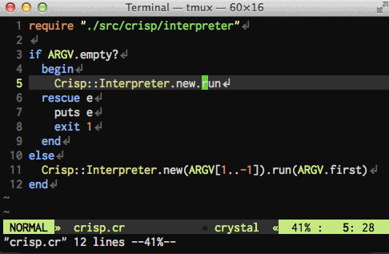

* [show-hierarchy.gif](vim-crystal/show-hierarchy.gif)

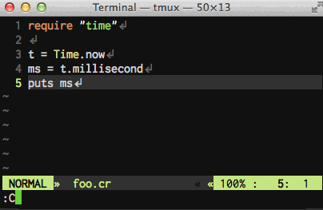

* [show-context.gif](vim-crystal/show-context.gif)

* [formatting.gif](vim-crystal/formatting.gif)

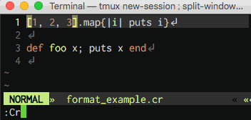

* [spec.gif](vim-crystal/spec.gif)

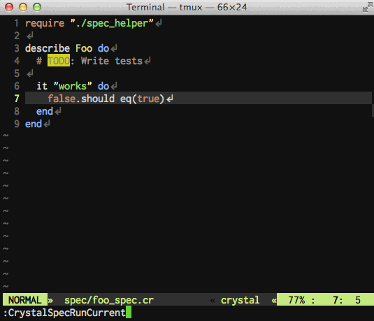

* [completion.gif](vim-crystal/completion.gif)

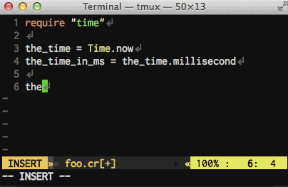

## [try-colorscheme.vim/](https://github.com/rhysd/try-colorscheme.vim/)
* [try-colorscheme.gif](try-colorscheme.vim/try-colorscheme.gif)

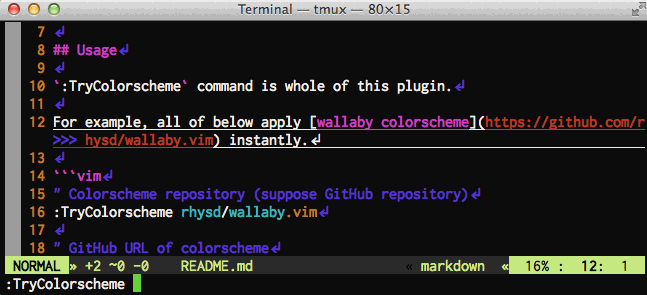

## [PocketTrend/](https://github.com/rhysd/PocketTrend/)
* [main.png](PocketTrend/main.png)

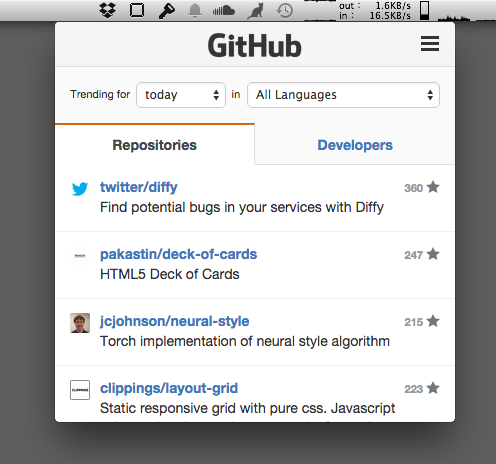

## [Crisp/](https://github.com/rhysd/Crisp/)
* [crisp.gif](Crisp/crisp.gif)

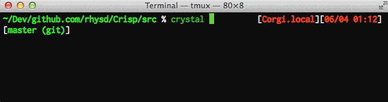

## [nyaovim-popup-tooltip/](https://github.com/rhysd/nyaovim-popup-tooltip/)
* [main.gif](nyaovim-popup-tooltip/main.gif)

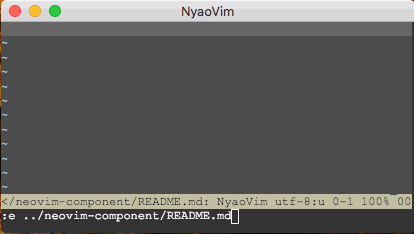

## [rust-doc.vim/](https://github.com/rhysd/rust-doc.vim/)
* [rust-doc.vim.gif](rust-doc.vim/rust-doc.vim.gif)

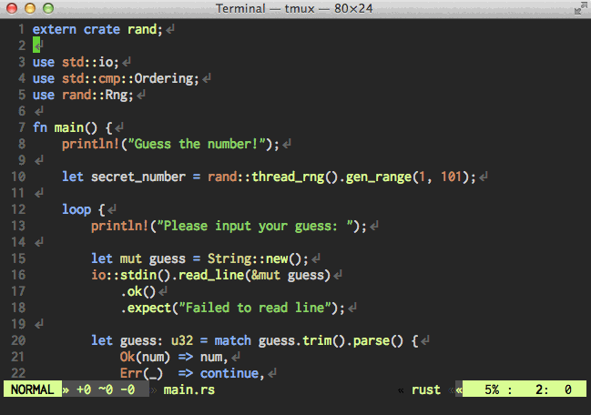

* [unite-rust-doc.gif](rust-doc.vim/unite-rust-doc.gif)

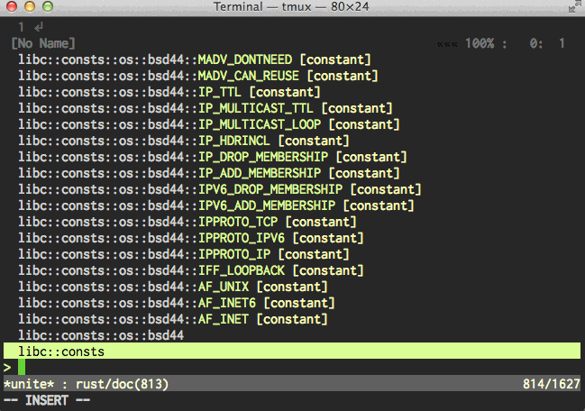

## [vim-color-shiny-white/](https://github.com/rhysd/vim-color-shiny-white/)
* [screenshot.png](vim-color-shiny-white/screenshot.png)

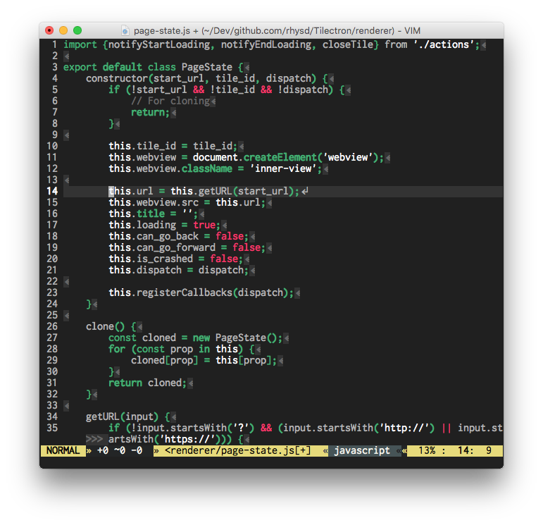

## [react-embedded-browser/](https://github.com/rhysd/react-embedded-browser/)
* [main.gif](react-embedded-browser/main.gif)

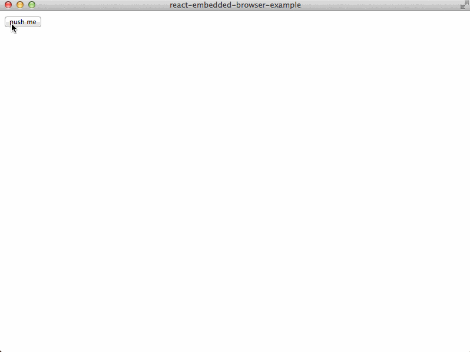

## [github-complete.vim/](https://github.com/rhysd/github-complete.vim/)
* [issue_completion.gif](github-complete.vim/issue_completion.gif)

* [emoji_completion.gif](github-complete.vim/emoji_completion.gif)

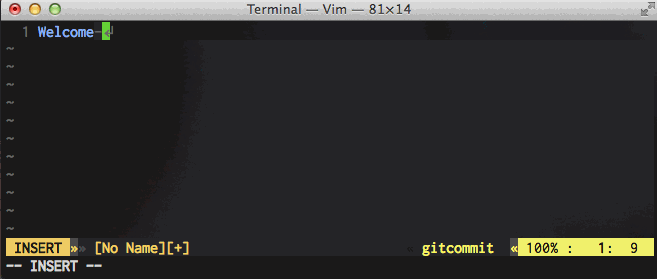

* [link_completion.gif](github-complete.vim/link_completion.gif)

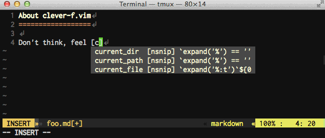

* [japanese_workaround.gif](github-complete.vim/japanese_workaround.gif)

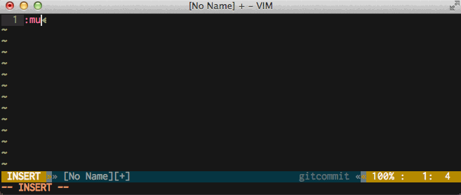

* [user_completion.gif](github-complete.vim/user_completion.gif)

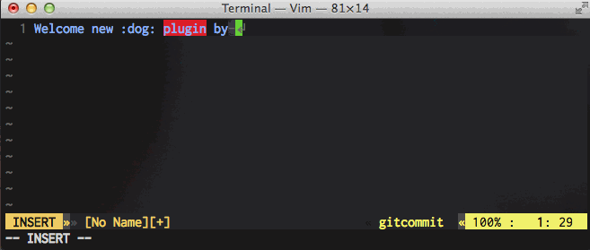

* [repo_completion.gif](github-complete.vim/repo_completion.gif)

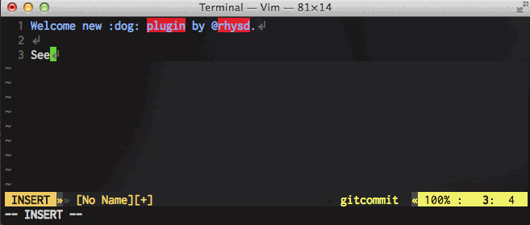

## [Shiba/](https://github.com/rhysd/Shiba/)
* [dock.png](Shiba/dock.png)

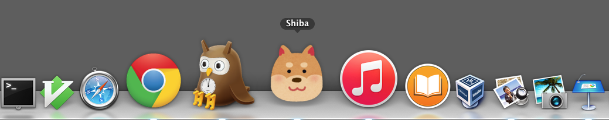

* [shiba-mermaid-integ.png](Shiba/shiba-mermaid-integ.png)

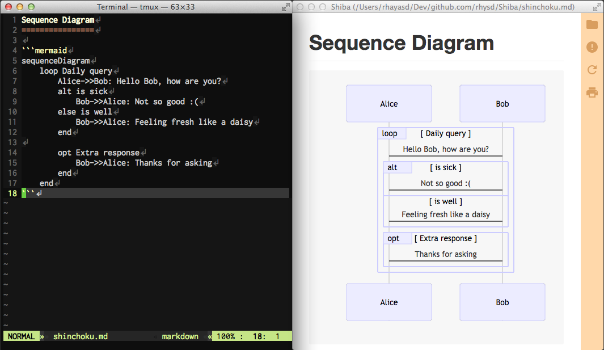

* [menu-errors.png](Shiba/menu-errors.png)

* [window-main.png](Shiba/window-main.png)

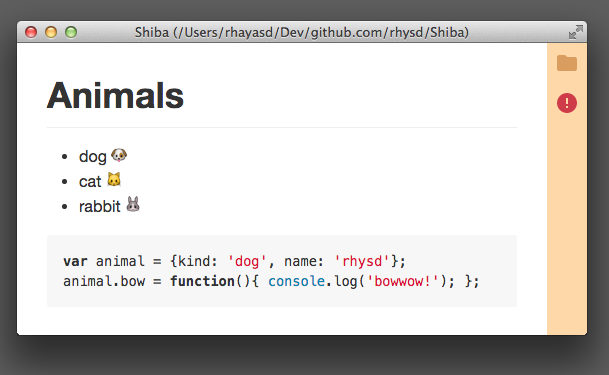

* [shiba-screenshot.gif](Shiba/shiba-screenshot.gif)

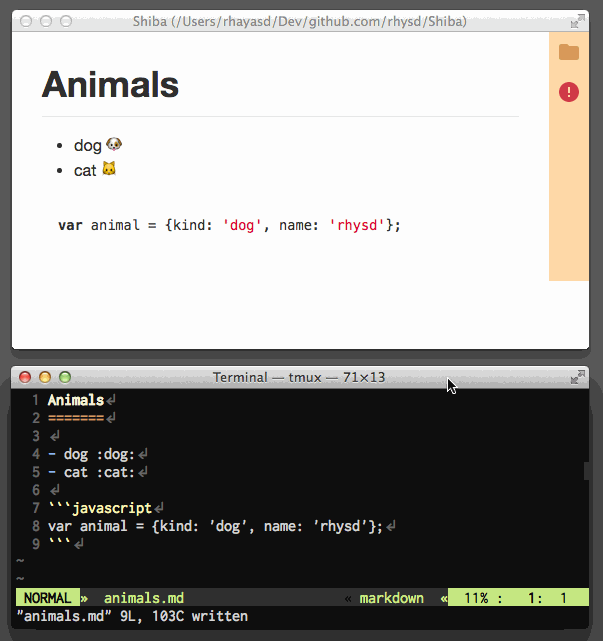

* [window-lint.png](Shiba/window-lint.png)

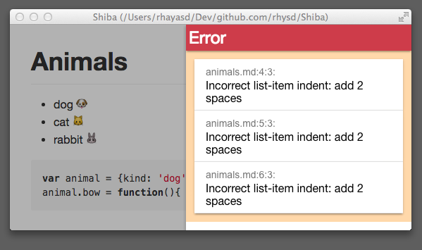

* [shiba-main-0.1.0.png](Shiba/shiba-main-0.1.0.png)

* [menu-no-error.png](Shiba/menu-no-error.png)

## [neovim-component/](https://github.com/rhysd/neovim-component/)
* [mini-browser.gif](neovim-component/mini-browser.gif)

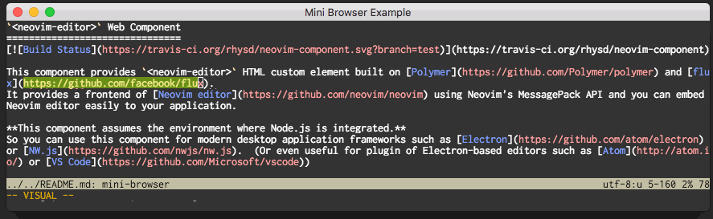

* [neovim-component-linux.png](neovim-component/neovim-component-linux.png)

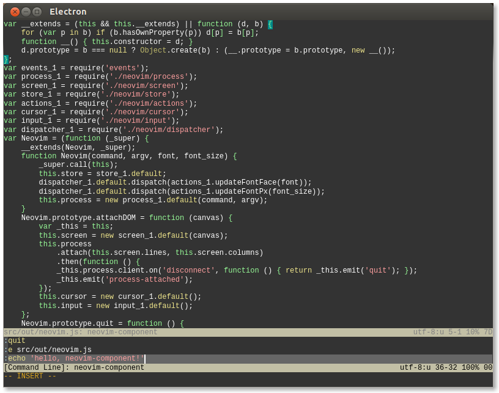

* [markdown-example.gif](neovim-component/markdown-example.gif)

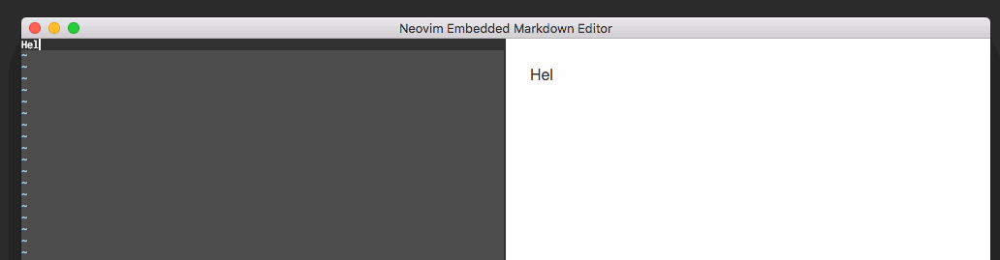

* [main.gif](neovim-component/main.gif)

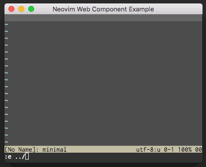

* [popup-image-example.gif](neovim-component/popup-image-example.gif)

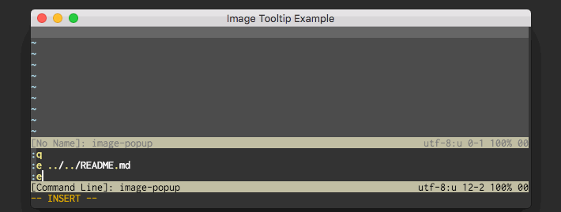

* [flow.png](neovim-component/flow.png)

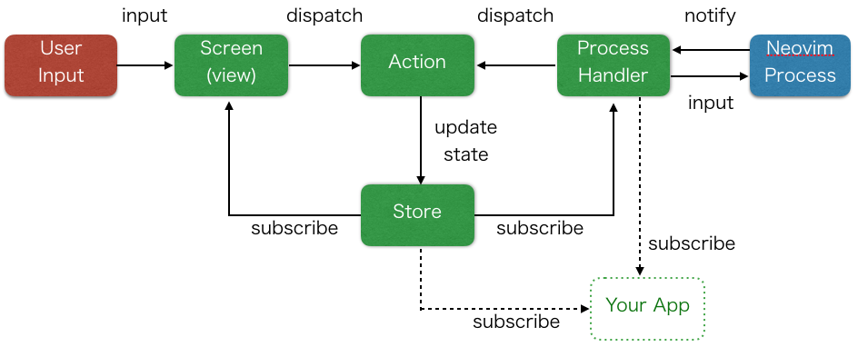

## [Rocket/](https://github.com/rhysd/Rocket/)
* [progress.png](Rocket/progress.png)

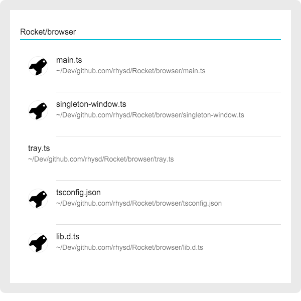

## [unite-n4140.vim/](https://github.com/rhysd/unite-n4140.vim/)
* [unite-n4140.gif](unite-n4140.vim/unite-n4140.gif)

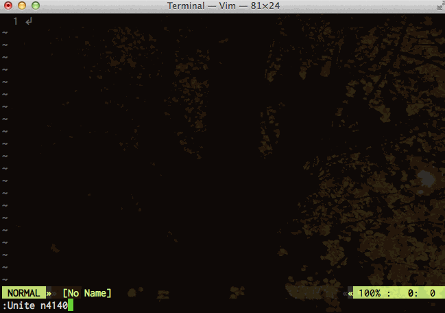

## [nyaovim-running-gopher/](https://github.com/rhysd/nyaovim-running-gopher/)
* [running-gopher.gif](nyaovim-running-gopher/running-gopher.gif)

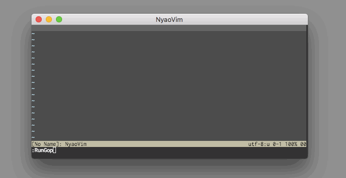

## [unite-emoji.vim/](https://github.com/rhysd/unite-emoji.vim/)
* [unite_emoji.gif](unite-emoji.vim/unite_emoji.gif)

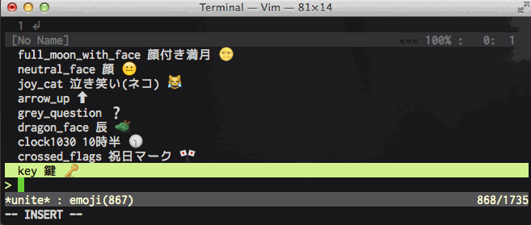

## [crdoc/](https://github.com/rhysd/crdoc/)
* [crdoc.gif](crdoc/crdoc.gif)

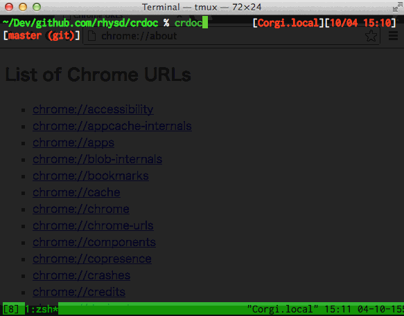

* [peco-crdoc.gif](crdoc/peco-crdoc.gif)

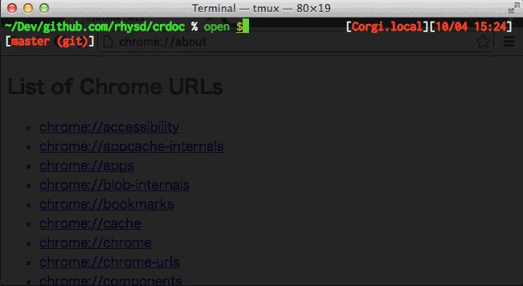

## [about-window/](https://github.com/rhysd/about-window/)
* [about-window-linux.png](about-window/about-window-linux.png)

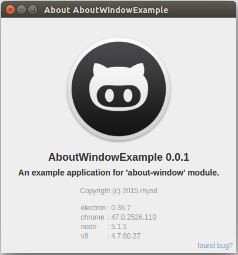

## [vim-color-splatoon/](https://github.com/rhysd/vim-color-splatoon/)
* [color-splatoon.gif](vim-color-splatoon/color-splatoon.gif)

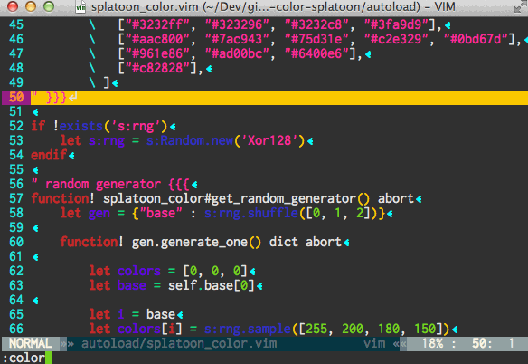

* [color-splatoon-1on1.gif](vim-color-splatoon/color-splatoon-1on1.gif)

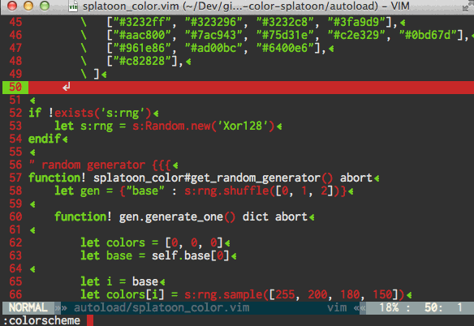

* [color-splatoon-random.gif](vim-color-splatoon/color-splatoon-random.gif)

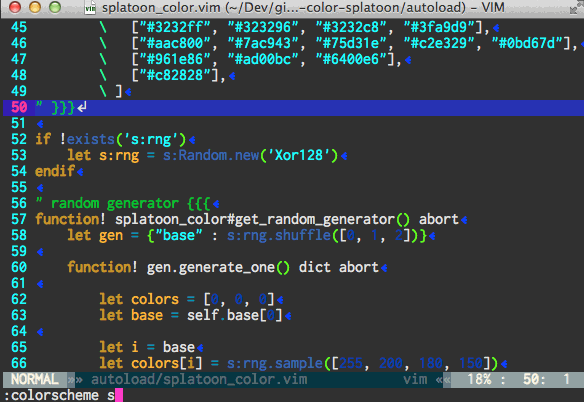

## [SoundKloud/](https://github.com/rhysd/SoundKloud/)
* [overall.png](SoundKloud/overall.png)

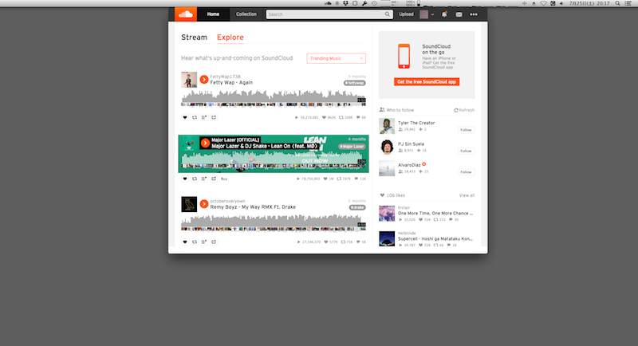

* [menubar.png](SoundKloud/menubar.png)

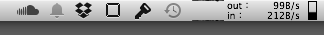

## [ezoe/](https://github.com/rhysd/ezoe/)
* [ezoe.png](ezoe/ezoe.png)

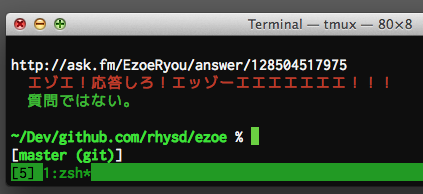

## [Irasutoyer/](https://github.com/rhysd/Irasutoyer/)
* [advanced.gif](Irasutoyer/advanced.gif)

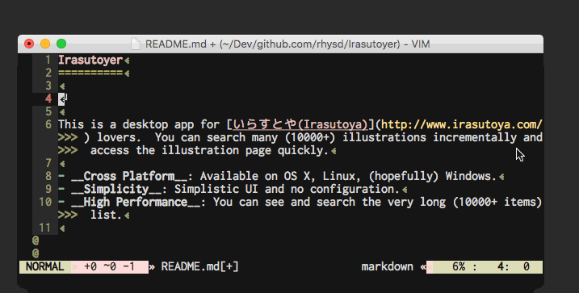

* [menu-items.png](Irasutoyer/menu-items.png)

* [Irasutoyer.gif](Irasutoyer/Irasutoyer.gif)

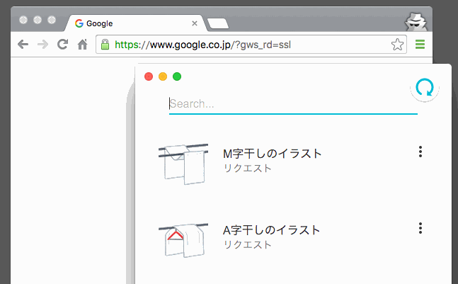

* [scraping.gif](Irasutoyer/scraping.gif)

* [Irasutoyer-linux.png](Irasutoyer/Irasutoyer-linux.png)

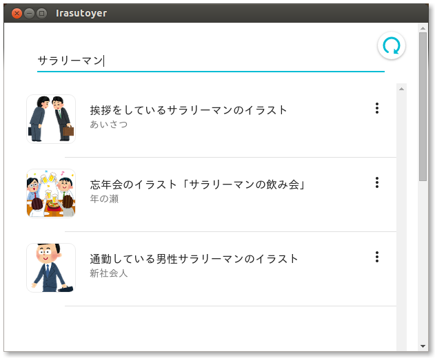

## [clever-f.vim/](https://github.com/rhysd/clever-f.vim/)
* [cleverf_1.gif](clever-f.vim/cleverf_1.gif)

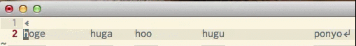

* [cleverf_main.gif](clever-f.vim/cleverf_main.gif)

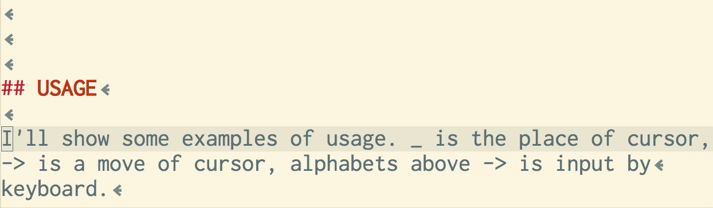

* [cleverf_3.gif](clever-f.vim/cleverf_3.gif)

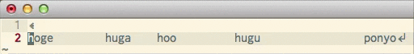

* [cleverf_2.gif](clever-f.vim/cleverf_2.gif)

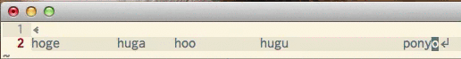

* [cleverf_4.gif](clever-f.vim/cleverf_4.gif)

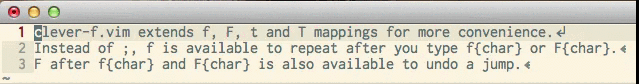

